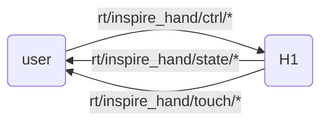

# Dexterous Hand SDK Introduction

The H1 can be equipped with [Inspire Robotics](https://inspire-robots.com/product/frwz/) humanoid five-finger dexterous hands. These hands have 6 degrees of freedom and 12 motion joints, and integrate 17 tactile sensors, enabling complex human-like hand movements.

## Control Methods

Inspire Robotics officially provides two communication methods: ModBusRTU via RS-485 serial and ModbusTCP. This SDK uses ModbusTCP to communicate with the dexterous hand and forwards data and control commands in DDS format.

The H1 provides a USB-to-serial adapter module. Users can plug this USB into the H1 development computing unit (PC2, PC3) for RS-485 communication to control the dexterous hand; in this case the port is typically `/dev/ttyUSB0`. The older version of the SDK can be used in this mode, but it does not support tactile sensor data retrieval. This version of the SDK does not support RS-485 serial communication.

1. Using the official Inspire SDK

Users can write their own programs to control the dexterous hand based on the official Inspire Dexterous Hand communication protocol.

2. Using the Unitree Dexterous Hand SDK

H1 communication is built on the DDS framework. To facilitate control of the dexterous hand using unitree_sdk2, Unitree provides a sample program that converts ModbusTCP send/receive data into DDS messages (download link at the bottom of this document).

## Unitree SDK Interface Description

Users send `"inspire::inspire_hand_ctrl"` messages to the `"rt/inspire_hand/ctrl/*"` topic to control the dexterous hand.
Receive `"inspire::inspire_hand_state"` messages from the `"rt/inspire_hand/state/*"` topic to get the dexterous hand state.
Receive `"inspire::inspire_hand_touch"` messages from the `"rt/inspire_hand/touch/*"` topic to get tactile sensor data.
The `*` is the topic suffix, default is `r` for the right hand.



## IDL Data Format

Motor data in array format, containing 12 motor data for both hands. For the specific format of MotorCmd_.idl and MotorState_.idl, see [Low-level Service Interface](https://support.unitree.com/home/zh/H1_developer/Basic_Services_Interface)

The dexterous hand data format is essentially the same as the official Inspire documentation. For details, see the `.idl` files in `inspire_hand_sdk/hand_idl`.

```cpp
//inspire_hand_ctrl.idl
module inspire
{
    struct inspire_hand_ctrl
    {
        sequence<int16,6>  pos_set;
        sequence<int16,6>  angle_set;
        sequence<int16,6>  force_set;
        sequence<int16,6>  speed_set;
        int8 mode;
    };
};

//inspire_hand_state.idl
module inspire
{
    struct inspire_hand_state
    {
        sequence<int16,6>  pos_act;
        sequence<int16,6>  angle_act;
        sequence<int16,6>  force_act;
        sequence<int16,6>  current;
        sequence<uint8,6>  err;
        sequence<uint8,6>  status;
        sequence<uint8,6>  temperature;
    };
};


//inspire_hand_touch.idl
module inspire
{
    struct inspire_hand_touch
    {
        sequence<int16,9>   fingerone_tip_touch;      // Pinky finger tip tactile data
        sequence<int16,96>  fingerone_top_touch;      // Pinky finger top tactile data
        sequence<int16,80>  fingerone_palm_touch;     // Pinky finger palm tactile data
        sequence<int16,9>   fingertwo_tip_touch;      // Ring finger tip tactile data
        sequence<int16,96>  fingertwo_top_touch;      // Ring finger top tactile data
        sequence<int16,80>  fingertwo_palm_touch;     // Ring finger palm tactile data
        sequence<int16,9>   fingerthree_tip_touch;    // Middle finger tip tactile data
        sequence<int16,96>  fingerthree_top_touch;    // Middle finger top tactile data
        sequence<int16,80>  fingerthree_palm_touch;   // Middle finger palm tactile data
        sequence<int16,9>   fingerfour_tip_touch;     // Index finger tip tactile data
        sequence<int16,96>  fingerfour_top_touch;     // Index finger top tactile data
        sequence<int16,80>  fingerfour_palm_touch;    // Index finger palm tactile data
        sequence<int16,9>   fingerfive_tip_touch;     // Thumb tip tactile data
        sequence<int16,96>  fingerfive_top_touch;     // Thumb top tactile data
        sequence<int16,9>   fingerfive_middle_touch;  // Thumb middle tactile data
        sequence<int16,96>  fingerfive_palm_touch;    // Thumb palm tactile data
        sequence<int16,112> palm_touch;                // Palm tactile data
    };

};

```

!!! note
    The control message adds a mode option. The combined mode of control commands is implemented in binary to specify commands:
    mode 0:  0000 (no operation)
    mode 1:  0001 (angle)
    mode 2:  0010 (position)
    mode 3:  0011 (angle + position)
    mode 4:  0100 (force control)
    mode 5:  0101 (angle + force control)
    mode 6:  0110 (position + force control)
    mode 7:  0111 (angle + position + force control)
    mode 8:  1000 (velocity)
    mode 9:  1001 (angle + velocity)
    mode 10: 1010 (position + velocity)
    mode 11: 1011 (angle + position + velocity)
    mode 12: 1100 (force control + velocity)
    mode 13: 1101 (angle + force control + velocity)
    mode 14: 1110 (position + force control + velocity)
    mode 15: 1111 (angle + position + force control + velocity)
!!!

+ Joint order in IDL

<div style="text-align: center;">
<table border="1">
  <tr>
    <td>Id</td>
    <td>0</td>
    <td>1</td>
    <td>2</td>
    <td>3</td>
    <td>4</td>
    <td>5</td>
  <tr>
    <td rowspan="2">Joint</td>
    <td colspan="6">Hand</td>
  </tr>
  <tr>
    <td>pinky</td>
    <td>ring</td>
    <td>middle</td>
    <td>index</td>
    <td>thumb-bend</td>
    <td>thumb-rotation</td>
  </tr>
</table>
</div>

---

# 
# SDK Installation and Usage
This SDK is primarily implemented in Python and depends on [`unitree_sdk2_python`](https://github.com/unitreerobotics/unitree_sdk2_python) at runtime. It also uses pyqt5 and pyqtgraph for visualization.

First, git clone the SDK workspace:

```bash
git clone https://github.com/NaCl-1374/inspire_hand_ws.git
```

It is recommended to use `venv` for virtual environment management:

```bash
python -m venv venv
source venv/bin/activate  # Linux/MacOS
# or
venv\Scripts\activate  # Windows
```

## Installing Dependencies

1. Install project dependencies:

    ```bash
    pip install -r requirements.txt
    ```

2. Update submodules:

    ```bash
    git submodule init  # Initialize submodules
    git submodule update  # Update submodules to the latest version
    ```

3. Install the two SDKs separately:

    ```bash
    cd unitree_sdk2_python
    pip install -e .

    cd ../inspire_hand_sdk
    pip install -e .
    ```
## Usage

## Dexterous Hand and Environment Configuration

First, configure the network for the device. The default IP of the dexterous hand is `192.168.11.210`; the device subnet must be on the same network segment as the dexterous hand. After configuration, run `ping 192.168.11.210` to verify communication.

If you need to adjust the dexterous hand IP or other parameters, you can run the **Dexterous Hand Configuration Panel** from the usage examples below to launch the panel for configuration.
After the panel starts, it will automatically read the device information on the current network. After modifying the parameters on the panel, click `Write Settings` to send the parameters to the dexterous hand. The parameters will not take effect yet; to apply them, click `Save Settings` and restart the device.

!!!note

    If you change the IP, you need to modify the following code in the relevant files, changing the `ip` option to the new IP:

    ``` python
        # inspire_hand_sdk/example/Vision_driver.py and inspire_hand_sdk/example/Headless_driver.py
        handler=inspire_sdk.ModbusDataHandler(ip=inspire_hand_defaut.defaut_ip,LR='r',device_id=1)

        # inspire_hand_sdk/example/init_set_inspire_hand.py
        window = MainWindow(ip=defaut_ip)
    ```
    The `LR` option is the parameter for the DDS message suffix `*`, and can be defined according to your device.
!!!


### Usage Examples

The following are descriptions of several common usage examples:

1. **DDS publish control commands**:

    Run the following script to publish control commands:
    ```bash
    python inspire_hand_sdk/example/dds_publish.py
    ```

2. **DDS subscribe to dexterous hand state and tactile sensor data, and visualize**:

    Run the following script to subscribe to the dexterous hand state and sensor data, and visualize the data:
    ```bash
    python inspire_hand_sdk/example/dds_subscribe.py
    ```

3. **Dexterous Hand DDS driver (headless mode)**:

    Use the following script for headless mode operation:
    ```bash
    python inspire_hand_sdk/example/Headless_driver.py
    ```

4. **Dexterous Hand configuration panel**:

    Run the following script to use the dexterous hand configuration panel:
    ```bash
    python inspire_hand_sdk/example/init_set_inspire_hand.py
    ```

5. **Dexterous Hand DDS driver (panel mode)**:

    Use the following script to enter panel mode and control the dexterous hand DDS driver:
    ```bash
    python inspire_hand_sdk/example/Vision_driver.py
    ```
6. **DDS publish control commands (C++)**:

    Run the following commands to compile and run the example program:
    ```bash
    cd inspire_hand_sdk
    mkdir build && cd build
    cmake ..
    make 
    ./hand_dds
    ```  
 !!! note

    If using multiple dexterous hands, copy the corresponding class as shown below and reset the `ip` and `LR` options:

    ``` python
        # inspire_hand_sdk/example/Vision_driver.py
        import sys
        from inspire_sdkpy import qt_tabs,inspire_sdk,inspire_hand_defaut
        # import inspire_sdkpy
        if __name__ == "__main__":
            app_r = qt_tabs.QApplication(sys.argv)
            handler_r=inspire_sdk.ModbusDataHandler(ip='********',LR='r',device_id=1)
            window_r = qt_tabs.MainWindow(data_handler=handler,dt=20,name="Hand Vision Driver")
            window_r.reflash()
            window_r.show()
            sys.exit(app_r.exec_())
            # copy for left hand
            app_l = qt_tabs.QApplication(sys.argv)
            handler_l=inspire_sdk.ModbusDataHandler(ip='********',LR='l',device_id=1)
            window_l = qt_tabs.MainWindow(data_handler=handler,dt=20,name="Hand Vision Driver")
            window_l.reflash()
            window_l.show()
            sys.exit(app_l.exec_())
    ```
 !!!

---
